---

# 🎮 Game Arcade Website

## 📌 Overview
This **Game Arcade Website** is a **browser-based collection** of classic games, fully optimized for **desktop and mobile devices**. The arcade includes:
- **🟡 Connect 4** (Built from scratch)
- **🔢 2048** (Built from scratch)
- **💣 Minesweeper** (Enhanced adaptation with UI and gameplay improvements)

Each game is independently designed with **dedicated HTML, CSS, and JavaScript** files, ensuring a **smooth and responsive user experience**.

📌 **Main Menu (Desktop & Mobile):**
<p align="left">
  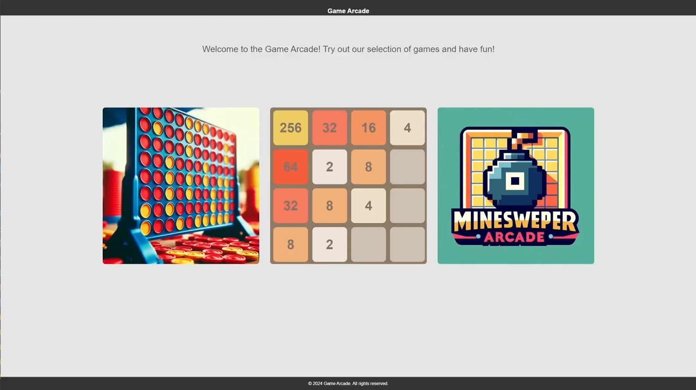
  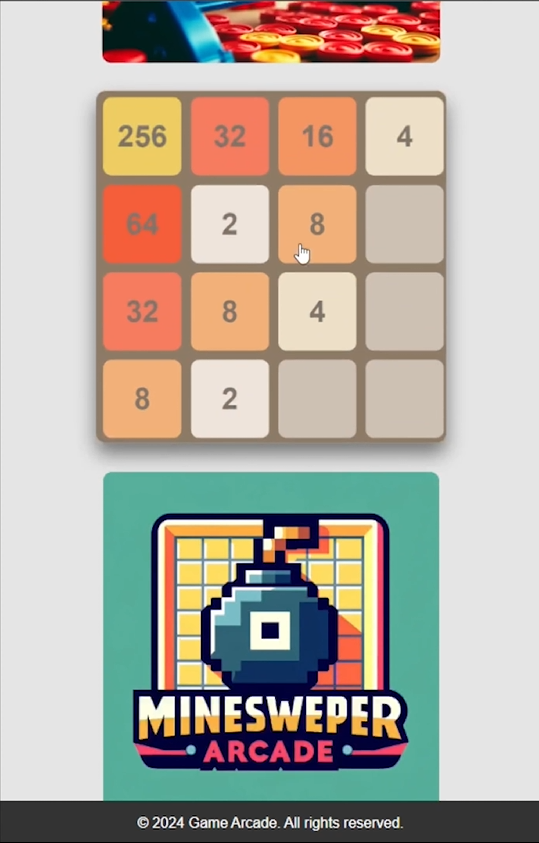
</p>

---

## 🎯 Key Features

### **1️⃣ Connect 4**
- **Fully functional** implementation from scratch.
- Interactive **player vs. player** mode.
- Smooth **animations and drop mechanics**.

📌 **Game Preview (Desktop & Mobile):**
<p align="left">
  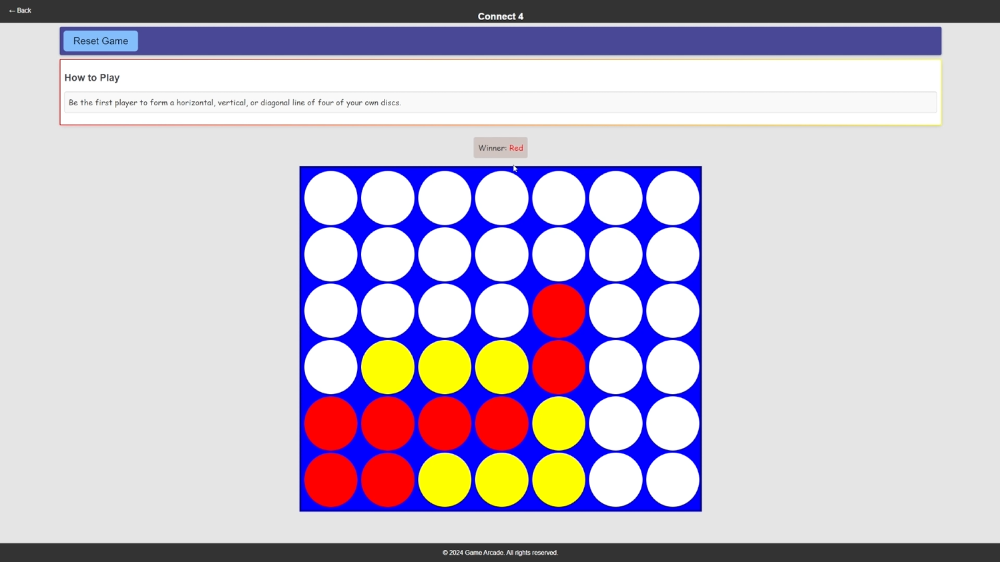
  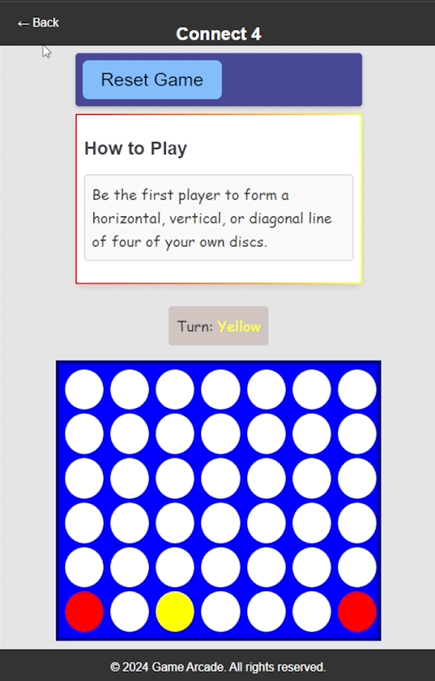
</p>

---

### **2️⃣ 2048**
- Developed with **custom logic and responsive design**.
- Supports **swipe controls on mobile** and **arrow key controls on desktop**.
- Keeps track of **highest score** and **best performance**.

📌 **Game Preview (Desktop & Mobile):**
<p align="left">
  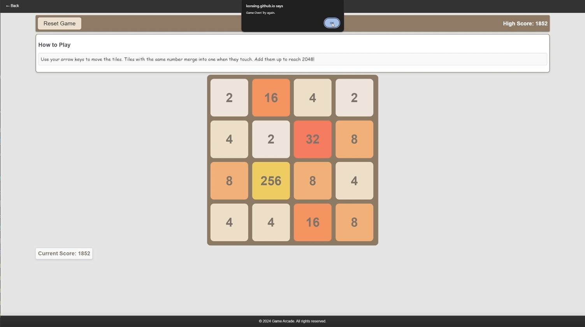
  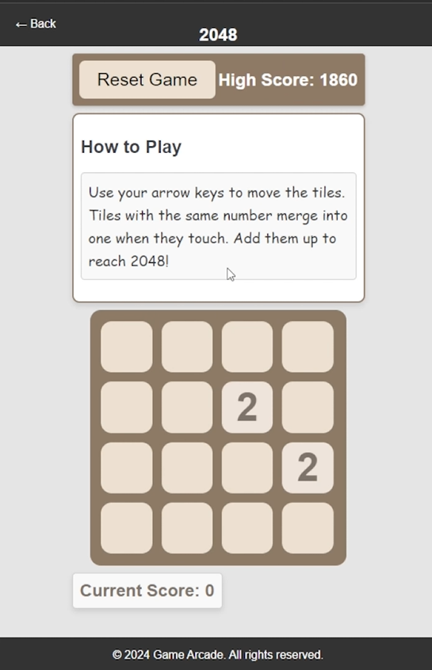
</p>

---

### **3️⃣ Minesweeper**
Minesweeper features **four difficulty levels**:
- 🟢 **Easy**
- 🟡 **Medium**
- 🔴 **Hard**
- ⚫ **Extreme**

The game is based on **Park Junha’s original Minesweeper**, but with **significant UI and gameplay enhancements**.

#### **🔧 Minesweeper Enhancements**
✔️ **Centralized Grid Layout** – The game grid is now centered for better UX.  
✔️ **Improved Color Scheme** – Enhanced contrast for better **visibility & aesthetics**.  
✔️ **New Flagging System** – Instead of **right-clicking**, players **toggle a flag mode** for placing flags.  
✔️ **Dynamic Game Reset** – Changing difficulty **instantly resets the board**, eliminating manual refresh.  
✔️ **Enhanced Visual Feedback** – Custom **numbered tiles** for better mine visibility.

📌 **Game Start Screen:**
<p align="left">
  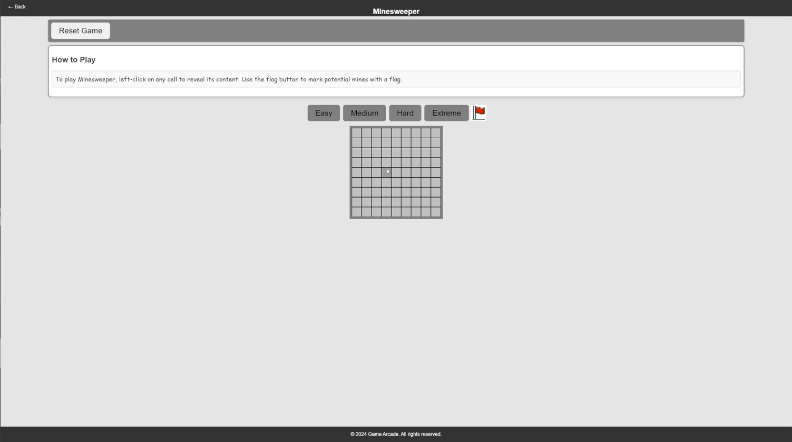
</p>

📌 **Game Over Screens (Loss & Win):**
<p align="left">
  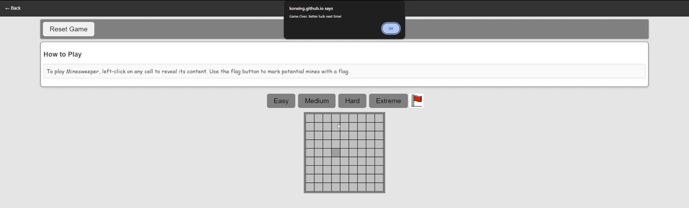
  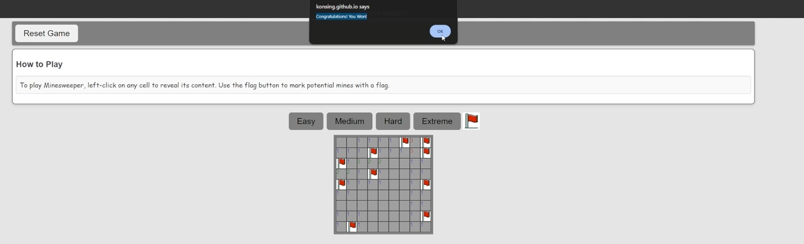
</p>

📌 **Alternative Game Over (Lost with Flags):**
<p align="left">
  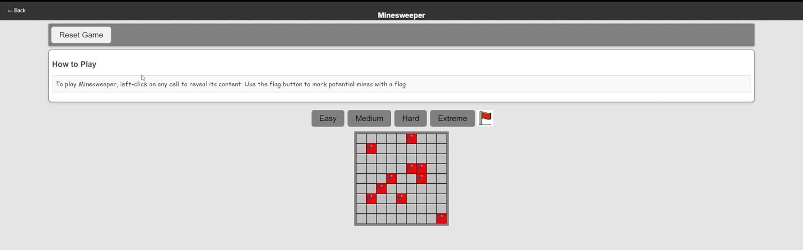
</p>

---

## 🌍 Fully Responsive Design
The entire website is optimized for **desktop and mobile**, ensuring a seamless experience across all devices.

📌 **Minesweeper on Mobile:**
<p align="left">
  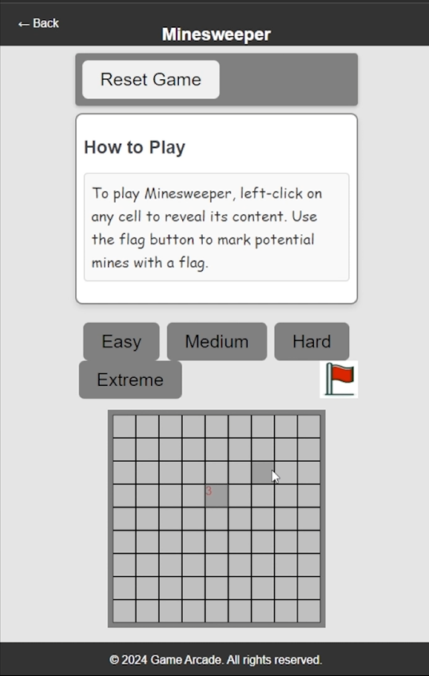
</p>

---

## 🛠️ Installation & Setup Guide

### 🔑 Prerequisites
Before running the project, ensure you have:
- **A modern web browser** (Chrome, Firefox, Edge, Safari)
- A local **HTTP server** (optional for local testing)

### 🚀 Setup Instructions
1️⃣ **Clone the Repository**
   ```sh
   git clone https://github.com/your-repo/game-arcade.git
   cd game-arcade
   ```

2️⃣ **Run a Local Server (Optional but Recommended)**
   ```sh
   python -m http.server 8000
   ```
   - Open `http://localhost:8000` in your browser.

3️⃣ **Enjoy Playing!** 🎮

---

## ⚡ Project Structure

```
📂 Game-Arcade-Site_2048_Minesweeper_Connect4
│── 📂 css
│── │── (Stylesheets for all games)
│
│── 📂 js
│   │── (JavaScript game logic files)
│
│── 2048.html                  # 2048 Game HTML file
│── 2048.png                   # Screenshot or image for 2048
│── Connect4.webp              # Screenshot for Connect 4
│── README.md                  # Project documentation
│── arcade.webp                # Screenshot for arcade site
│── connect4.html              # Connect 4 Game HTML file
│── god_of_war.jpg             # (Unrelated image in project)
│── green-flag.png             # Minesweeper flag asset
│── index.html                 # Main arcade homepage
│── minesweeper.html           # Minesweeper Game HTML file
│── minesweeper.jpg            # Screenshot for Minesweeper
│── red-flag.png               # Minesweeper flag asset
```

---

## 🎨 How It Works
1. **Choose a Game** – The arcade menu allows players to select **Connect 4, 2048, or Minesweeper**.
2. **Enjoy Seamless Gameplay** – Each game runs **smoothly on both desktop and mobile**.
3. **Switch Between Games Instantly** – Navigation is fast and intuitive.

---

## 📊 Future Improvements
🔹 **Add AI Opponent for Connect 4** – Implementing **minimax AI** for solo play.  
🔹 **High Score Leaderboard** – Persistent tracking of **top scores** for 2048 & Minesweeper.  
🔹 **Theming System** – Custom **color themes** for Minesweeper and Connect 4.  
🔹 **More Classic Games** – Expanding the arcade with **Tetris, Snake, and Pong**.  

---

## 📜 License
This project is licensed under the **MIT License**.

---